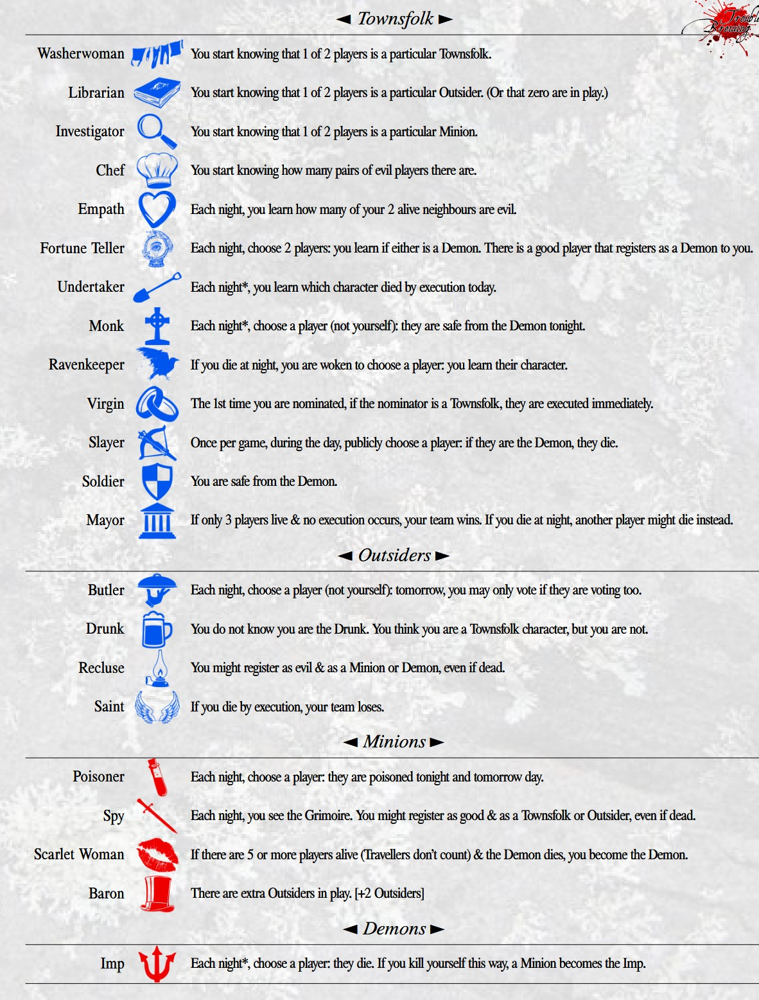

# Blood on the Clocktower (Trouble Brewing) Solver
## Clocktower Solver

Given the information exchanged during a game of Blood on the Clocktower (specifically Trouble Brewing), 
my program calculates every conceivable possibility, and can compute the probability someone is evil.
### Sample Output

## What is Blood on the Clocktower?
Designed by The Pandemonium Institute, Blood on the Clocktower (known as Clocktower), is a hidden role social deduction game, similar in format to Mafia, Ultimate Werewolf, and Town of Salem.

Played with up to 15 people, the town works together to find and execute the demon in their town.

Below is what is called a  **Script**, containing ever character in play. The script is called **Trouble Brewing**, and it is the one that I have solved.

### Role Types Summary
#### Townsfolk
Townsfolk use their abilities to root out the demon.

#### Outsiders
Outsiders are on the good team, but they come with abilities that act as hindrances.

#### Minions
Minions work for the demon. They conceal who the real demon is by spreading misinformation and using their abilities.

#### Demons
There is only one demon on Trouble Brewing: the Imp. When executed, good team wins. Each night the imp eliminates someone from the game.

## Using the Solver
Sample code can be found in `ClocktowerWorldBuilder/Program.cs`. That file details how to use it on your own games.

## Limitations
This can handle everything in Trouble Brewing except Recluse starpassing, which never happens.